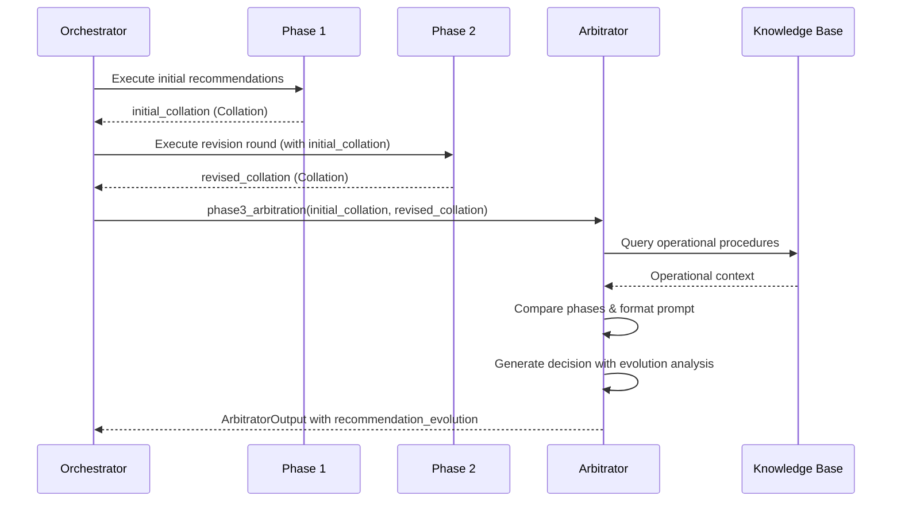

# Design Document: Arbitrator Dual-Phase Input

## Overview

This design enhances the SkyMarshal Arbitrator to receive and analyze both Phase 1 (initial) and Phase 2 (revised) agent recommendations. The enhancement provides the arbitrator with complete context about how agent recommendations evolved during the multi-round orchestration process, enabling more informed conflict resolution decisions.

The key insight is that recommendation stability and evolution patterns provide valuable signals:

- **Convergence**: Agents moving toward agreement indicates consensus building
- **Divergence**: Agents moving apart may indicate unresolved conflicts
- **Stability**: Unchanged recommendations suggest high confidence
- **Changes**: Modified recommendations may indicate new information or influence from other agents

## Architecture

The enhancement follows the existing three-phase orchestration architecture with minimal changes to the data flow:



### Data Flow Changes

1. **main.py**: `phase3_arbitration` receives both collations from `handle_disruption`
2. **arbitrator/agent.py**: `arbitrate` function accepts optional `initial_recommendations` parameter
3. **arbitrator/agent.py**: New helper function `_format_phase_comparison` generates comparison text
4. **schemas.py**: New `RecommendationEvolution` model for tracking changes

## Components and Interfaces

### Modified Functions

#### 1. `phase3_arbitration` (main.py)

```python
async def phase3_arbitration(
    revised_collation: Collation,
    llm: Any,
    thread_id: str = None,
    checkpoint_saver: CheckpointSaver = None,
    initial_collation: Optional[Collation] = None  # NEW: Optional for backward compatibility
) -> dict:
    """
    Phase 3: Arbitration with checkpoint persistence.

    Now accepts optional initial_collation to provide Phase 1 context
    to the arbitrator for better conflict resolution.

    Args:
        revised_collation: Collated revised recommendations from phase 2
        llm: Model instance
        thread_id: Optional thread identifier for checkpoint persistence
        checkpoint_saver: Optional checkpoint saver for state persistence
        initial_collation: Optional Phase 1 collation for evolution analysis

    Returns:
        dict: Final arbitrated decision with recommendation_evolution
    """
```

#### 2. `arbitrate` (agents/arbitrator/agent.py)

```python
async def arbitrate(
    revised_recommendations: Union[Collation, dict],
    llm_opus: Optional[Any] = None,
    initial_recommendations: Optional[Union[Collation, dict]] = None  # NEW
) -> dict:
    """
    Resolve conflicts and make final decision.

    Now accepts optional initial_recommendations to analyze how
    agent recommendations evolved between Phase 1 and Phase 2.

    Args:
        revised_recommendations: Phase 2 revised agent responses
        llm_opus: Optional Claude Opus 4.5 model instance
        initial_recommendations: Optional Phase 1 initial agent responses

    Returns:
        dict: Arbitrator decision with recommendation_evolution field
    """
```

### New Helper Functions

#### 3. `_format_phase_comparison` (agents/arbitrator/agent.py)

```python
def _format_phase_comparison(
    initial_responses: Dict[str, Any],
    revised_responses: Dict[str, Any]
) -> str:
    """
    Format a comparison of Phase 1 vs Phase 2 recommendations.

    Generates a structured comparison showing:
    - Which agents changed recommendations
    - Direction of change (converged/diverged/unchanged)
    - Confidence score changes
    - Binding constraint changes

    Args:
        initial_responses: Dict of Phase 1 agent responses
        revised_responses: Dict of Phase 2 agent responses

    Returns:
        str: Formatted comparison text for arbitrator prompt
    """
```

#### 4. `_analyze_recommendation_evolution` (agents/arbitrator/agent.py)

```python
def _analyze_recommendation_evolution(
    initial_responses: Dict[str, Any],
    revised_responses: Dict[str, Any]
) -> List[Dict[str, Any]]:
    """
    Analyze how recommendations evolved between phases.

    Returns a list of evolution records for agents that changed,
    including before/after summaries and change classification.

    Args:
        initial_responses: Dict of Phase 1 agent responses
        revised_responses: Dict of Phase 2 agent responses

    Returns:
        List of evolution records with agent_name, phase1_summary,
        phase2_summary, change_type, and details
    """
```

### Updated System Prompt

The `ARBITRATOR_SYSTEM_PROMPT` will be extended with a new section:

```python
PHASE_EVOLUTION_INSTRUCTIONS = """
## Phase Evolution Analysis

When both Phase 1 (initial) and Phase 2 (revised) recommendations are provided, you MUST analyze the evolution of recommendations:

### Interpreting Phase Differences

1. **Convergence (Positive Signal)**:
   - Agents moving toward agreement after seeing others' recommendations
   - Indicates consensus building and collaborative refinement
   - Increases confidence in the converged recommendation
   - Example: Network agent initially recommended 2-hour delay, revised to 4-hour delay after seeing crew constraints

2. **Divergence (Warning Signal)**:
   - Agents moving further apart after seeing others' recommendations
   - May indicate unresolved conflicts or competing priorities
   - Requires careful conflict resolution
   - Example: Finance agent strengthened cost concerns after seeing network impact

3. **Stability (High Confidence Signal)**:
   - Agents maintaining their recommendation despite seeing others
   - Indicates strong conviction based on domain expertise
   - Especially significant for safety agents with binding constraints
   - Example: Crew compliance maintained FDP violation finding

4. **New Constraints (Critical Signal)**:
   - Binding constraints added in Phase 2 that weren't in Phase 1
   - May indicate new information discovered during revision
   - Must be treated as non-negotiable
   - Example: Maintenance agent discovered MEL item during deeper analysis

### Using Phase Evolution in Decision Making

- Weight stable safety constraints more heavily than fluctuating business recommendations
- Investigate divergence patterns to understand root causes
- Use convergence as validation of the recommended approach
- Note any agents that changed from "approved" to "cannot proceed" or vice versa
- Document phase evolution in your reasoning for audit trail
"""
```

## Data Models

### New Schema: RecommendationEvolution

```python
class AgentEvolution(BaseModel):
    """Evolution of a single agent's recommendation between phases."""

    agent_name: str = Field(description="Name of the agent")
    phase1_recommendation: Optional[str] = Field(
        default=None,
        description="Phase 1 recommendation text (None if agent not in Phase 1)"
    )
    phase2_recommendation: str = Field(
        description="Phase 2 recommendation text"
    )
    phase1_confidence: Optional[float] = Field(
        default=None,
        description="Phase 1 confidence score"
    )
    phase2_confidence: float = Field(
        description="Phase 2 confidence score"
    )
    change_type: Literal["unchanged", "converged", "diverged", "new_in_phase2", "dropped_in_phase2"] = Field(
        description="Classification of how the recommendation changed"
    )
    binding_constraints_added: List[str] = Field(
        default_factory=list,
        description="Binding constraints added in Phase 2"
    )
    binding_constraints_removed: List[str] = Field(
        default_factory=list,
        description="Binding constraints removed in Phase 2"
    )
    change_summary: str = Field(
        description="Human-readable summary of the change"
    )


class RecommendationEvolution(BaseModel):
    """Complete evolution analysis across all agents."""

    phases_available: List[str] = Field(
        description="Which phases were provided (e.g., ['phase1', 'phase2'])"
    )
    agents_changed: int = Field(
        description="Count of agents that changed recommendations"
    )
    agents_unchanged: int = Field(
        description="Count of agents with stable recommendations"
    )
    convergence_detected: bool = Field(
        description="Whether agents showed convergence pattern"
    )
    divergence_detected: bool = Field(
        description="Whether agents showed divergence pattern"
    )
    evolution_details: List[AgentEvolution] = Field(
        default_factory=list,
        description="Detailed evolution for each agent"
    )
    analysis_summary: str = Field(
        description="Overall summary of recommendation evolution"
    )
```

### Updated ArbitratorOutput Schema

The existing `ArbitratorOutput` schema will be extended:

```python
class ArbitratorOutput(BaseModel):
    # ... existing fields ...

    # NEW: Phase evolution analysis
    recommendation_evolution: Optional[RecommendationEvolution] = Field(
        default=None,
        description="Analysis of how recommendations evolved between Phase 1 and Phase 2"
    )
    phases_considered: List[str] = Field(
        default_factory=lambda: ["phase2"],
        description="Which phases were available for decision making"
    )
```

## Correctness Properties

_A property is a characteristic or behavior that should hold true across all valid executions of a system—essentially, a formal statement about what the system should do. Properties serve as the bridge between human-readable specifications and machine-verifiable correctness guarantees._

### Property 1: Dual Collation Acceptance

_For any_ valid Collation objects representing Phase 1 and Phase 2 recommendations, both `phase3_arbitration` and `arbitrate` functions SHALL accept both collations as parameters without raising errors, and SHALL produce a valid arbitrator output.

**Validates: Requirements 1.1, 1.2**

### Property 2: Phase Comparison Formatting Completeness

_For any_ pair of valid Phase 1 and Phase 2 collations, the formatted phase comparison SHALL contain an entry for every agent present in either phase, with each entry including: recommendation text, confidence score, binding constraints (if any), and change classification (unchanged/converged/diverged/new_in_phase2/dropped_in_phase2).

**Validates: Requirements 2.1, 2.2, 2.3, 2.4**

### Property 3: Recommendation Evolution Output Completeness

_For any_ pair of valid Phase 1 and Phase 2 collations provided to the arbitrator, the output SHALL include a `recommendation_evolution` field containing: `agents_changed` count, `agents_unchanged` count, `convergence_detected` flag, `divergence_detected` flag, and `evolution_details` list with before/after summaries and binding constraint changes for each agent.

**Validates: Requirements 4.1, 4.2, 4.3, 4.4**

### Property 4: Partial Data Handling

_For any_ pair of collations where agents have asymmetric presence (agent in one phase but not the other) or mixed success/error statuses across phases, the arbitrator SHALL correctly classify each agent's evolution status as one of: "unchanged", "converged", "diverged", "new_in_phase2", or "dropped_in_phase2", and SHALL use successful responses when available.

**Validates: Requirements 5.1, 5.2, 5.3**

### Property 5: Output Structure Preservation

_For any_ arbitration result (with or without Phase 1 collation), the output SHALL contain: `phases_considered` list, `knowledge_base` metadata with `documents_found`, `applicable_protocols`, and `query_timestamp` fields, and SHALL preserve the original collation data in the audit trail when both phases are provided.

**Validates: Requirements 6.1, 6.2, 6.3, 6.4, 7.4, 7.5**

### Property 6: Knowledge Base Independence

_For any_ arbitration call (with or without initial_collation), the knowledge base query SHALL occur, and the arbitrator prompt SHALL include both operational procedures context (when available) and phase comparison (when both phases provided) as separate sections.

**Validates: Requirements 7.2, 7.3**

## Error Handling

### Backward Compatibility Errors

| Scenario                            | Handling                                                        |
| ----------------------------------- | --------------------------------------------------------------- |
| `initial_collation` is None         | Proceed with Phase 2 only, set `phases_considered = ["phase2"]` |
| `initial_collation` is invalid type | Log warning, proceed with Phase 2 only                          |
| Agent missing from Phase 1          | Mark as "new_in_phase2" in evolution                            |
| Agent missing from Phase 2          | Mark as "dropped_in_phase2" in evolution                        |

### Phase Data Errors

| Scenario                                     | Handling                                                    |
| -------------------------------------------- | ----------------------------------------------------------- |
| Agent timeout in Phase 1, success in Phase 2 | Use Phase 2 response, note discrepancy                      |
| Agent success in Phase 1, timeout in Phase 2 | Use Phase 1 response for comparison, mark Phase 2 as failed |
| Agent error in both phases                   | Include in evolution with error status                      |
| Empty collation                              | Raise ValueError (existing behavior)                        |

### Knowledge Base Errors

| Scenario                | Handling                                                             |
| ----------------------- | -------------------------------------------------------------------- |
| KB query fails          | Log warning, proceed without operational context (existing behavior) |
| KB returns no documents | Set `knowledgeBaseConsidered = False`, continue                      |
| KB timeout              | Log warning, proceed without operational context                     |

## Testing Strategy

### Unit Tests

Unit tests verify specific examples and edge cases:

1. **Backward Compatibility Tests**
   - Test `phase3_arbitration` with only `revised_collation` (no initial)
   - Test `arbitrate` with `initial_recommendations=None`
   - Verify output structure matches existing format

2. **Helper Function Tests**
   - Test `_format_phase_comparison` with various input combinations
   - Test `_analyze_recommendation_evolution` change classification
   - Test edge cases: empty collations, single agent, all agents changed

3. **Schema Validation Tests**
   - Test `AgentEvolution` model with all change types
   - Test `RecommendationEvolution` model serialization
   - Test updated `ArbitratorOutput` with new fields

4. **System Prompt Tests**
   - Verify `PHASE_EVOLUTION_INSTRUCTIONS` contains required guidance
   - Verify prompt includes convergence/divergence instructions

### Property-Based Tests

Property-based tests verify universal properties across generated inputs using Hypothesis:

**Configuration**: Minimum 100 iterations per property test

**Test Tags**: Each test tagged with `Feature: arbitrator-dual-phase-input, Property N: {property_text}`

1. **Property 1 Test**: Generate random valid Collation pairs, verify both functions accept them
2. **Property 2 Test**: Generate collation pairs with varying agents, verify comparison completeness
3. **Property 3 Test**: Generate collation pairs, verify evolution output has all required fields
4. **Property 4 Test**: Generate collations with asymmetric agents/statuses, verify classification
5. **Property 5 Test**: Generate arbitration results, verify output structure
6. **Property 6 Test**: Generate arbitration calls with/without initial_collation, verify KB independence

### Integration Tests

1. **End-to-End Flow Test**
   - Run full `handle_disruption` with mocked agents
   - Verify Phase 1 collation passed to Phase 3
   - Verify audit trail contains both phases

2. **Knowledge Base Integration Test**
   - Mock KB client, verify query occurs with both phases
   - Verify prompt contains both operational context and phase comparison

### Test File Locations

- `test/test_arbitrator.py` - Extend with dual-phase tests
- `test/test_phase_execution.py` - Update `phase3_arbitration` signature tests
- `test/test_schemas.py` - Add `RecommendationEvolution` schema tests
