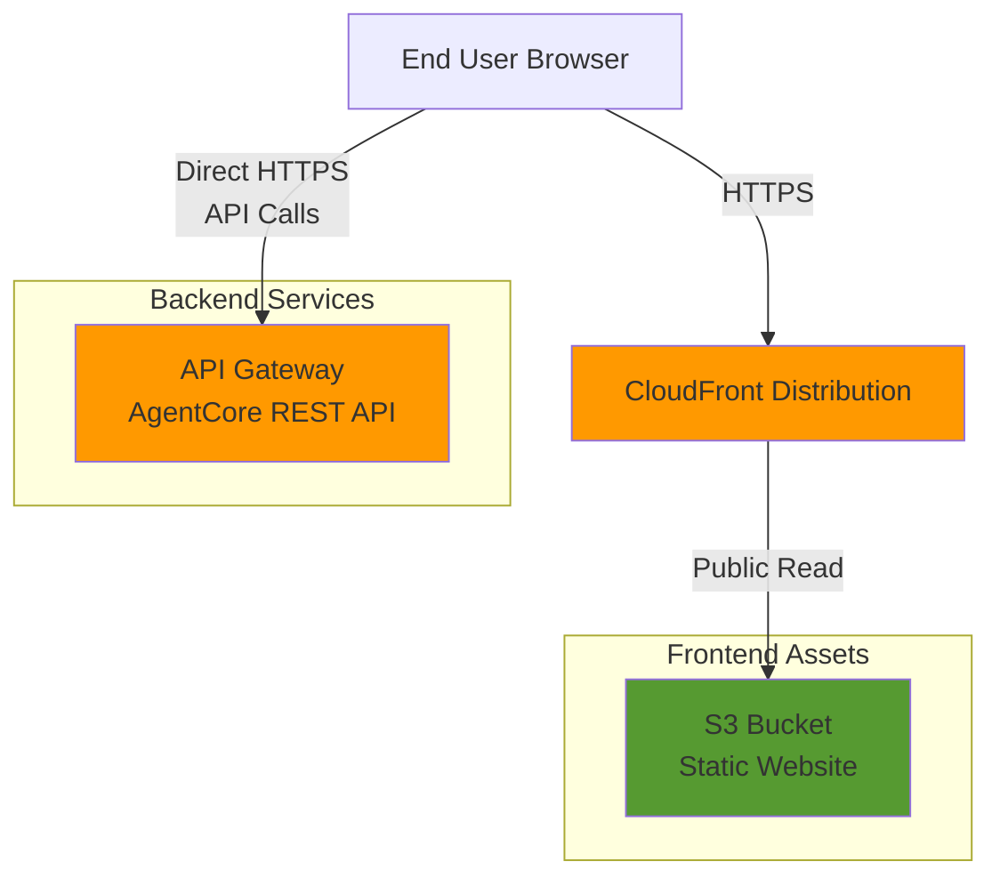
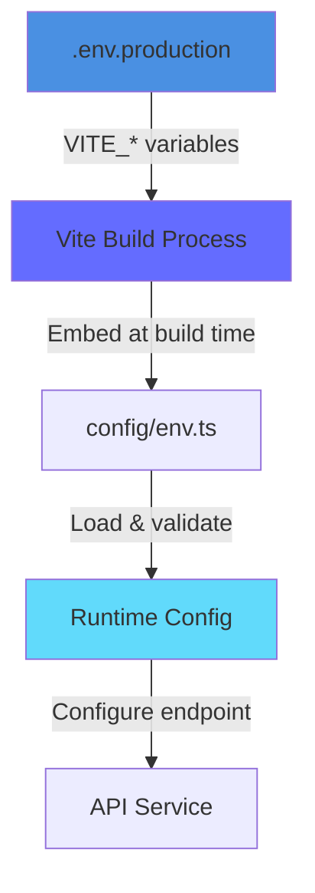

# Design Document: Frontend Production Deployment

## Overview

This design specifies the architecture and implementation for deploying the SkyMarshal frontend to AWS S3 and CloudFront for production use. The solution eliminates the development-only Vite proxy dependency and enables direct API connectivity between the frontend and the AgentCore REST API Gateway.

The deployment architecture follows AWS best practices for static website hosting with:

- S3 for storage with versioning and encryption
- CloudFront for global CDN with HTTPS
- Origin Access Identity for secure S3 access
- Infrastructure as Code using Terraform
- Automated deployment scripts with verification

The design ensures zero-downtime deployments, proper cache invalidation, and rollback capability while maintaining security through CORS configuration and encrypted storage.

## Architecture

### High-Level Architecture



### Deployment Flow

```mermaid
graph LR
    Dev[Developer]
    Build[Build Process]
    S3[S3 Bucket]
    CF[CloudFront]
    Verify[Verification]

    Dev -->|1. Run deploy script| Build
    Build -->|2. npm run build| Build
    Build -->|3. Upload assets| S3
    S3 -->|4. Invalidate cache| CF
    CF -->|5. Check deployment| Verify

    style Build fill:#232F3E
    style S3 fill:#569A31
    style CF fill:#FF9900
```



### Environment Configuration Flow



## Components and Interfaces

### 1. Environment Configuration Module

**Location**: `frontend/config/env.ts`

**Purpose**: Load and validate environment-specific configuration

**Modifications Required**:

- Update `validateConfig()` to enforce HTTPS URLs in production mode
- Add production mode detection based on `import.meta.env.PROD`
- Ensure mock fallback is disabled when `VITE_USE_MOCK_FALLBACK !== 'true'`

**Interface**:

```typescript
interface EnvironmentConfig {
  apiEndpoint: string; // Direct API Gateway URL in production
  awsRegion: string; // AWS region (us-east-1)
  apiTimeout: number; // Timeout in milliseconds
  isDevelopment: boolean; // false in production
  enableMock: boolean; // false in production
  useMockFallback: boolean; // false in production
  mockFallbackTimeout: number;
  mockSolutionFile: string;
}

function loadConfig(): EnvironmentConfig;
function validateConfig(config: Partial<EnvironmentConfig>): void;
```

### 2. Production Environment File

**Location**: `frontend/.env.production`

**Purpose**: Production-specific environment variables

**Content**:

```bash
# Production API Configuration
VITE_API_ENDPOINT=https://kkyfoiq8il.execute-api.us-east-1.amazonaws.com/dev/api/v1
VITE_AWS_REGION=us-east-1
VITE_API_TIMEOUT=120

# Disable mock features in production
VITE_ENABLE_MOCK=false
VITE_USE_MOCK_FALLBACK=false
```

**Validation**: Build process must fail if required variables are missing or invalid

### 3. Vite Production Configuration

**Location**: `frontend/vite.config.ts`

**Purpose**: Build configuration for production

**Modifications Required**:

- Proxy configuration is ignored in production builds (only applies to dev server)
- Ensure build output is optimized with minification and code splitting
- Verify environment variable substitution works correctly

**No changes needed** - existing configuration already supports production builds correctly.

### 4. S3 Bucket Infrastructure

**Resource**: `aws_s3_bucket.frontend`

**Configuration**:

- Bucket name: `skymarshal-prod-frontend-{account_id}`
- Region: `us-east-1`
- Versioning: Enabled
- Encryption: AES256 server-side encryption
- Public access: Enabled for read access (GetObject)
- Website hosting: Enabled with `index.html` as index document

**Bucket Policy**:

```json
{
  "Version": "2012-10-17",
  "Statement": [
    {
      "Sid": "PublicReadGetObject",
      "Effect": "Allow",
      "Principal": "*",
      "Action": "s3:GetObject",
      "Resource": "arn:aws:s3:::skymarshal-prod-frontend-{account_id}/*"
    }
  ]
}
```

### 5. CloudFront Distribution

**Resource**: `aws_cloudfront_distribution.frontend`

**Configuration**:

- Origin: S3 bucket website endpoint (public access)
- Default root object: `index.html`
- Viewer protocol policy: `redirect-to-https`
- Allowed methods: `GET, HEAD, OPTIONS`
- Cached methods: `GET, HEAD`
- Compress: `true` (gzip/brotli)
- Price class: `PriceClass_100` (US, Canada, Europe)
- Custom error responses:
  - 404 → `/index.html` (status 200) for SPA routing
  - 403 → `/index.html` (status 200) for SPA routing

**Cache Behavior**:

- Default TTL: 86400 seconds (24 hours)
- Max TTL: 31536000 seconds (1 year)
- Min TTL: 0 seconds
- Forward query strings: `false`
- Forward cookies: `none`

### 6. API Gateway CORS Configuration

**Resource**: API Gateway REST API (existing)

**Required CORS Headers**:

```
Access-Control-Allow-Origin: https://{cloudfront-domain}
Access-Control-Allow-Methods: POST, GET, OPTIONS
Access-Control-Allow-Headers: Content-Type, Authorization
Access-Control-Max-Age: 3600
```

**Implementation**: Update API Gateway to include CORS configuration for the CloudFront domain. This may require updating the AgentCore deployment configuration or adding a custom domain with proper CORS settings.

**Note**: The current API Gateway endpoint (`https://kkyfoiq8il.execute-api.us-east-1.amazonaws.com/dev`) must be configured to accept requests from the CloudFront origin.

### 7. Deployment Script

**Location**: `frontend/deploy.sh`

**Purpose**: Automated deployment with verification

**Steps**:

1. Validate environment configuration
2. Run production build (`npm run build`)
3. Sync assets to S3 bucket
4. Create CloudFront cache invalidation
5. Wait for invalidation to complete
6. Verify deployment by checking key files
7. Report success or failure

**Interface**:

```bash
./deploy.sh [--dry-run] [--skip-build] [--skip-invalidation]

Options:
  --dry-run              Show what would be deployed without deploying
  --skip-build           Skip the build step (use existing dist/)
  --skip-invalidation    Skip CloudFront cache invalidation
```

**Exit Codes**:

- 0: Success
- 1: Environment validation failed
- 2: Build failed
- 3: S3 upload failed
- 4: CloudFront invalidation failed
- 5: Verification failed

### 8. Terraform Infrastructure Module

**Location**: `terraform/modules/frontend/`

**Purpose**: Define frontend infrastructure as code

**Resources**:

- `aws_s3_bucket.frontend`
- `aws_s3_bucket_versioning.frontend`
- `aws_s3_bucket_server_side_encryption_configuration.frontend`
- `aws_s3_bucket_website_configuration.frontend`
- `aws_s3_bucket_policy.frontend`
- `aws_cloudfront_distribution.frontend`

**Outputs**:

- `cloudfront_domain_name`: CloudFront distribution domain
- `cloudfront_distribution_id`: For cache invalidation
- `s3_bucket_name`: S3 bucket name
- `s3_bucket_arn`: S3 bucket ARN

**Variables**:

- `environment`: Environment name (prod, staging, dev)
- `project_name`: Project name (skymarshal)
- `aws_region`: AWS region (us-east-1)

## Data Models

### Environment Configuration

```typescript
interface EnvironmentConfig {
  // API endpoint - must be HTTPS URL in production
  apiEndpoint: string;

  // AWS region for API calls
  awsRegion: string;

  // API timeout in milliseconds
  apiTimeout: number;

  // Development mode flag
  isDevelopment: boolean;

  // Mock mode (disabled in production)
  enableMock: boolean;

  // Mock fallback (disabled in production)
  useMockFallback: boolean;
  mockFallbackTimeout: number;
  mockSolutionFile: string;
}
```

### Deployment Configuration

```typescript
interface DeploymentConfig {
  // S3 bucket for frontend assets
  bucketName: string;

  // CloudFront distribution ID
  distributionId: string;

  // AWS region
  region: string;

  // Build output directory
  buildDir: string;

  // Cache invalidation paths
  invalidationPaths: string[];
}
```

### Terraform Variables

```hcl
variable "environment" {
  description = "Environment name (prod, staging, dev)"
  type        = string
  default     = "prod"
}

variable "project_name" {
  description = "Project name"
  type        = string
  default     = "skymarshal"
}

variable "aws_region" {
  description = "AWS region"
  type        = string
  default     = "us-east-1"
}

variable "cloudfront_price_class" {
  description = "CloudFront price class"
  type        = string
  default     = "PriceClass_100"
}

variable "enable_versioning" {
  description = "Enable S3 versioning"
  type        = bool
  default     = true
}
```

## Correctness Properties

_A property is a characteristic or behavior that should hold true across all valid executions of a system—essentially, a formal statement about what the system should do. Properties serve as the bridge between human-readable specifications and machine-verifiable correctness guarantees._

### Property 1: HTTPS URL Validation in Production

_For any_ environment configuration in production mode, if the API endpoint is not a valid HTTPS URL, then validation should fail with a clear error message.

**Validates: Requirements 1.5**

### Property 2: Build Failure on Invalid Environment

_For any_ build attempt with missing or invalid required environment variables, the build process should fail with a descriptive error message before generating output.

**Validates: Requirements 1.6, 2.6**

### Property 3: Production Build Uses Direct API Endpoint

_For any_ production build, the generated bundle should contain the direct API Gateway HTTPS URL and not contain relative proxy paths (e.g., "/api").

**Validates: Requirements 1.2, 8.1, 8.2**

### Property 4: Mock Fallback Disabled in Production

_For any_ production configuration where `VITE_USE_MOCK_FALLBACK` is false or unset, the mock fallback code path should never be executed during API calls.

**Validates: Requirements 1.3, 8.5**

### Property 5: Content Hash in Build Filenames

_For any_ production build output, all JavaScript and CSS asset filenames should include content hashes for cache busting (matching pattern: `*-[hash].{js,css}`).

**Validates: Requirements 2.2**

### Property 6: S3 Upload Completeness

_For any_ deployment, all files present in the `dist/` directory should be uploaded to the S3 bucket with matching paths and content.

**Validates: Requirements 6.3**

### Property 7: Deployment Script Error Handling

_For any_ deployment failure scenario (build failure, upload failure, invalidation failure), the deployment script should exit with a non-zero status code and output a specific error message indicating the failure type.

**Validates: Requirements 6.6, 9.5**

### Property 8: CORS Headers Present

_For any_ API request from the frontend to the API Gateway, the response should include the required CORS headers (Access-Control-Allow-Origin, Access-Control-Allow-Methods, Access-Control-Allow-Headers).

**Validates: Requirements 5.1**

### Property 9: API Error Handling

_For any_ API error response (4xx or 5xx status codes), the frontend should display a user-friendly error message and not expose raw error details to the user.

**Validates: Requirements 8.3**

### Property 10: Terraform Idempotency

_For any_ Terraform configuration, running `terraform apply` multiple times with the same configuration should result in no changes after the first apply and should not cause data loss.

**Validates: Requirements 7.6**

### Property 11: CloudFront SPA Routing

_For any_ request to a non-existent path on the CloudFront distribution (404 error), the response should serve `index.html` with a 200 status code to support client-side routing.

**Validates: Requirements 4.5, 4.7**

## Error Handling

### Build-Time Errors

**Environment Validation Errors**:

- Missing required environment variables → Fail build with message listing missing variables
- Invalid API endpoint format → Fail build with message explaining HTTPS requirement
- Invalid timeout values → Fail build with message explaining valid range

**Build Process Errors**:

- TypeScript compilation errors → Display compiler errors and fail build
- Asset optimization errors → Display error details and fail build
- Output directory write errors → Display permission/disk space errors and fail build

### Deployment Errors

**Pre-Deployment Validation**:

- Missing AWS credentials → Exit with error code 1 and message about AWS configuration
- Invalid S3 bucket name → Exit with error code 1 and message about bucket configuration
- Missing CloudFront distribution ID → Exit with error code 1 and message about infrastructure setup

**Upload Errors**:

- S3 upload failure → Retry up to 3 times, then exit with error code 3
- Partial upload → Report which files failed and exit with error code 3
- Permission denied → Exit with error code 3 and message about IAM permissions

**Cache Invalidation Errors**:

- CloudFront invalidation API failure → Exit with error code 4 and message
- Invalidation timeout (>5 minutes) → Exit with error code 4 and message
- Invalid distribution ID → Exit with error code 4 and message

**Verification Errors**:

- index.html not accessible → Exit with error code 5 and message with URL attempted
- JavaScript assets return 404 → Exit with error code 5 and list of missing assets
- Assets corrupted (wrong content-type) → Exit with error code 5 and details

### Runtime Errors

**API Communication Errors**:

- Network timeout → Display "Request timed out. Please try again." message
- 4xx client errors → Display "Invalid request. Please check your input." message
- 5xx server errors → Display "Service temporarily unavailable. Please try again later." message
- CORS errors → Log detailed error to console (dev mode only), display generic network error to user

**Configuration Errors**:

- Invalid API endpoint at runtime → Log error to console and display "Configuration error" message
- Missing required configuration → Fail fast at application startup with console error

### Rollback Procedures

**Failed Deployment Rollback**:

1. Identify the previous successful deployment version in S3 (using versioning)
2. Copy previous version objects to current (overwrite failed deployment)
3. Create CloudFront invalidation for all paths (`/*`)
4. Verify rollback by checking index.html accessibility
5. Log rollback action with timestamp and version information

**Infrastructure Rollback**:

1. Use `terraform plan` to preview changes before applying
2. If apply fails, use `terraform state` to inspect current state
3. Use `terraform import` to recover resources if state is corrupted
4. Use S3 versioning to restore previous Terraform state file if needed
5. Document all manual interventions in deployment log

## Testing Strategy

### Unit Tests

Unit tests focus on specific examples, edge cases, and error conditions for individual components:

**Environment Configuration Tests** (`config/env.test.ts`):

- Test loading valid production configuration
- Test validation failure with missing VITE_API_ENDPOINT
- Test validation failure with HTTP (non-HTTPS) endpoint in production
- Test validation failure with invalid timeout values
- Test that mock fallback is disabled when VITE_USE_MOCK_FALLBACK is false
- Test that development mode detection works correctly

**API Service Tests** (`services/apiAsync.test.ts`):

- Test API URL construction with configured endpoint
- Test that relative paths are not used in production mode
- Test error message formatting for different error types
- Test that mock fallback is not called when disabled
- Test CORS error handling

**Build Configuration Tests**:

- Test that production build excludes source maps
- Test that vendor chunks are created
- Test that assets are output to dist/ directory
- Test that minification is enabled in production mode

### Property-Based Tests

Property-based tests verify universal properties across all inputs. Each test should run a minimum of 100 iterations.

**Property Test 1: HTTPS URL Validation** (`config/env.property.test.ts`):

- **Feature: frontend-production-deployment, Property 1: HTTPS URL Validation in Production**
- Generate random URL strings (HTTP, HTTPS, relative, malformed)
- Set production mode
- Verify only HTTPS URLs pass validation
- Verify non-HTTPS URLs fail with appropriate error

**Property Test 2: Build Environment Validation** (`build/validation.property.test.ts`):

- **Feature: frontend-production-deployment, Property 2: Build Failure on Invalid Environment**
- Generate random combinations of environment variables (some missing, some invalid)
- Attempt build with each combination
- Verify build fails when required variables are missing
- Verify error messages mention the specific missing variables

**Property Test 3: Content Hash Consistency** (`build/output.property.test.ts`):

- **Feature: frontend-production-deployment, Property 5: Content Hash in Build Filenames**
- Run production build multiple times with same source
- Verify all JS/CSS files have hash suffixes
- Verify identical source produces identical hashes
- Verify changed source produces different hashes

**Property Test 4: S3 Upload Completeness** (`deploy/upload.property.test.ts`):

- **Feature: frontend-production-deployment, Property 6: S3 Upload Completeness**
- Generate random file structures in dist/
- Run upload to S3 (test bucket)
- Verify all files are present in S3
- Verify file contents match exactly

**Property Test 5: Deployment Error Codes** (`deploy/errors.property.test.ts`):

- **Feature: frontend-production-deployment, Property 7: Deployment Script Error Handling**
- Simulate various failure scenarios (missing credentials, invalid bucket, network errors)
- Run deployment script for each scenario
- Verify appropriate exit codes (1-5)
- Verify error messages are descriptive

**Property Test 6: API Error Handling** (`services/errors.property.test.ts`):

- **Feature: frontend-production-deployment, Property 9: API Error Handling**
- Generate random API error responses (various 4xx and 5xx codes)
- Trigger API calls that return these errors
- Verify user-friendly messages are displayed
- Verify raw error details are not exposed to users

### Integration Tests

Integration tests verify that components work together correctly:

**Infrastructure Integration Tests** (`terraform/test/`):

- Test Terraform plan generates expected resources
- Test S3 bucket is created with correct configuration
- Test CloudFront distribution is created with correct origin
- Test bucket policy allows CloudFront OAI access
- Test public access block is configured correctly
- Test that multiple terraform apply runs are idempotent

**Deployment Integration Tests** (`deploy/integration.test.ts`):

- Test full deployment flow (build → upload → invalidate → verify)
- Test dry-run mode doesn't make actual changes
- Test deployment with --skip-build uses existing dist/
- Test verification catches missing files
- Test rollback procedure restores previous version

**End-to-End Tests** (`e2e/`):

- Test deployed frontend loads successfully via CloudFront
- Test API calls from frontend to API Gateway succeed
- Test CORS headers are present in API responses
- Test 404 routes serve index.html for SPA routing
- Test assets are compressed (gzip/brotli)
- Test HTTPS redirect works correctly

### Testing Tools

- **Unit & Integration Tests**: Jest or Vitest (already configured with Vite)
- **Property-Based Tests**: fast-check (TypeScript property-based testing library)
- **Infrastructure Tests**: Terratest (Go-based Terraform testing framework)
- **E2E Tests**: Playwright or Cypress
- **Deployment Tests**: Bash test framework (bats) or custom shell scripts

### Test Configuration

All property-based tests must be configured with:

```typescript
import fc from 'fast-check';

// Minimum 100 iterations per property test
fc.assert(
  fc.property(/* generators */, (/* inputs */) => {
    // Property assertion
  }),
  { numRuns: 100 }
);
```

### Continuous Integration

Tests should run automatically on:

- Pull requests (unit + property tests)
- Merge to main branch (all tests including integration)
- Before deployment (deployment + verification tests)
- Scheduled daily runs (full E2E suite)
