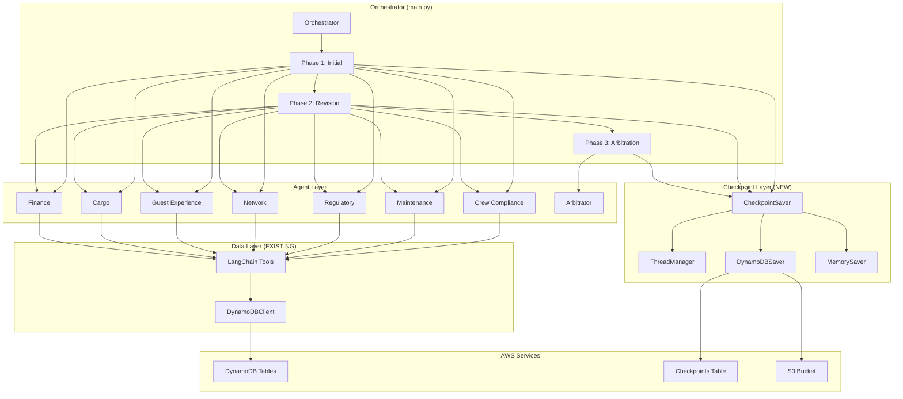

# Design Document: LangGraph DynamoDB Integration

## Overview

This design document specifies the integration of LangGraph's DynamoDBSaver checkpoint persistence into the SkyMarshal multi-agent orchestrator. The current implementation uses direct boto3 DynamoDB queries for operational data (flights, crew, cargo) but lacks durable state management for agent execution. This integration adds checkpoint persistence while preserving the existing operational data access patterns.

### Current Architecture

**Operational Data Access (Preserved)**:

- Direct boto3 DynamoDB client (`DynamoDBClient` singleton)
- 16 operational tables (Flights, CrewRoster, CargoShipments, etc.)
- GSI-based queries for efficient data retrieval
- LangChain `@tool` decorators for agent access
- No state persistence or checkpoint management

**Orchestration Pattern (Enhanced)**:

- Three-phase workflow: Initial → Revision → Arbitration
- Parallel agent execution within phases
- Natural language prompt processing
- No checkpoint persistence (in-memory only)
- No failure recovery mechanism

### Target Architecture

**Dual-Purpose DynamoDB Usage**:

1. **Operational Data** (existing, unchanged): Direct boto3 queries via `DynamoDBClient`
2. **Checkpoint Persistence** (new): LangGraph DynamoDBSaver for agent state

**Key Additions**:

- DynamoDBSaver for checkpoint persistence
- Thread management for multi-round workflows
- Failure recovery from last checkpoint
- Human-in-the-loop approval points
- Time-travel debugging for audit trails
- S3 integration for large checkpoints (≥350KB)

### Design Principles

1. **Separation of Concerns**: Operational data queries remain unchanged; checkpoint persistence is additive
2. **Backward Compatibility**: Existing agents work without modification
3. **Incremental Migration**: Support mixed mode (some agents with checkpoints, some without)
4. **Development Flexibility**: In-memory checkpoints for dev, DynamoDB for production
5. **Conservative Fallbacks**: System degrades gracefully when checkpoints unavailable

## Architecture

### Component Diagram



### Data Flow

**Phase 1: Initial Recommendations with Checkpoints**

```
User Prompt
  → Orchestrator creates thread_id
  → Orchestrator saves initial checkpoint (thread start)
  → Phase 1 begins
    → All 7 agents execute in parallel
    → Each agent:
      → Loads thread context from checkpoint
      → Queries operational data via DynamoDBClient
      → Performs analysis
      → Saves checkpoint with decision
    → Phase 1 collates results
    → Orchestrator saves phase 1 checkpoint
```

**Phase 2: Revision with Checkpoints**

```
Phase 1 Checkpoint
  → Orchestrator loads phase 1 results
  → Phase 2 begins
    → All 7 agents execute in parallel
    → Each agent:
      → Loads thread context + phase 1 results
      → Reviews other agents' recommendations
      → Queries additional operational data if needed
      → Revises recommendation
      → Saves checkpoint with revised decision
    → Phase 2 collates results
    → Orchestrator saves phase 2 checkpoint
```

**Phase 3: Arbitration with Checkpoints**

```
Phase 2 Checkpoint
  → Orchestrator loads phase 2 results
  → Phase 3 begins
    → Arbitrator executes
      → Loads thread context + all phase results
      → Queries Knowledge Base for precedent
      → Resolves conflicts
      → Makes final decision
      → Saves checkpoint with final decision
      → OPTIONAL: Pauses for human approval
    → Orchestrator saves final checkpoint
```

**Failure Recovery**

```
Agent Crash
  → Orchestrator detects failure
  → Queries last successful checkpoint for thread
  → Restores agent state from checkpoint
  → Resumes execution from checkpoint
  → Continues workflow
```

## Components and Interfaces

### 1. CheckpointSaver (New)

**Purpose**: Abstraction layer over DynamoDBSaver and MemorySaver

**Location**: `src/checkpoint/saver.py`

**Interface**:

```python
class CheckpointSaver:
    """Abstraction for checkpoint persistence"""

    def __init__(self, mode: str = "production"):
        """
        Initialize checkpoint saver

        Args:
            mode: "production" (DynamoDB) or "development" (in-memory)
        """

    async def save_checkpoint(
        self,
        thread_id: str,
        checkpoint_id: str,
        state: dict,
        metadata: dict
    ) -> None:
        """Save checkpoint to persistence layer"""

    async def load_checkpoint(
        self,
        thread_id: str,
        checkpoint_id: str = None
    ) -> dict:
        """Load checkpoint from persistence layer"""

    async def list_checkpoints(
        self,
        thread_id: str
    ) -> List[dict]:
        """List all checkpoints for a thread"""

    async def get_thread_history(
        self,
        thread_id: str
    ) -> List[dict]:
        """Get complete audit trail for a thread"""
```

**Implementation Details**:

- Wraps `langgraph-checkpoint-aws` DynamoDBSaver
- Falls back to MemorySaver in development mode
- Handles serialization/deserialization
- Manages S3 uploads for large checkpoints
- Implements exponential backoff for DynamoDB throttling

### 2. ThreadManager (New)

**Purpose**: Manage thread lifecycle and metadata

**Location**: `src/checkpoint/thread_manager.py`

**Interface**:

```python
class ThreadManager:
    """Manage thread lifecycle"""

    def create_thread(self, user_prompt: str) -> str:
        """Create new thread and return thread_id"""

    def get_thread_status(self, thread_id: str) -> str:
        """Get thread status (active, completed, failed)"""

    def mark_thread_complete(self, thread_id: str) -> None:
        """Mark thread as complete"""

    def mark_thread_failed(self, thread_id: str, error: str) -> None:
        """Mark thread as failed with error"""

    async def query_threads(
        self,
        status: str = None,
        limit: int = 100
    ) -> List[dict]:
        """Query threads by status"""
```

### 3. Enhanced Orchestrator

**Purpose**: Integrate checkpoint persistence into three-phase workflow

**Location**: `src/main.py` (modified)

**Key Changes**:

```python
async def handle_disruption(
    user_prompt: str,
    llm: Any,
    mcp_tools: list,
    checkpoint_saver: CheckpointSaver
) -> dict:
    """
    Three-phase orchestration with checkpoint persistence

    NEW: Creates thread, saves checkpoints at each phase,
    supports failure recovery
    """

    # Create thread
    thread_id = thread_manager.create_thread(user_prompt)

    # Save initial checkpoint
    await checkpoint_saver.save_checkpoint(
        thread_id=thread_id,
        checkpoint_id="start",
        state={"user_prompt": user_prompt},
        metadata={"phase": "start"}
    )

    try:
        # Phase 1 with checkpoints
        initial_collation = await phase1_with_checkpoints(
            user_prompt, llm, mcp_tools, thread_id, checkpoint_saver
        )

        # Phase 2 with checkpoints
        revised_collation = await phase2_with_checkpoints(
            user_prompt, initial_collation, llm, mcp_tools,
            thread_id, checkpoint_saver
        )

        # Phase 3 with checkpoints
        final_decision = await phase3_with_checkpoints(
            revised_collation, llm, thread_id, checkpoint_saver
        )

        # Mark thread complete
        thread_manager.mark_thread_complete(thread_id)

        return final_decision

    except Exception as e:
        # Mark thread failed
        thread_manager.mark_thread_failed(thread_id, str(e))

        # Attempt recovery
        return await recover_from_failure(thread_id, checkpoint_saver)
```

### 4. Agent Checkpoint Integration

**Purpose**: Add checkpoint save points to agent execution

**Location**: `src/agents/*/agent.py` (modified)

**Pattern**:

```python
async def analyze_<agent_name>(
    payload: dict,
    llm: Any,
    mcp_tools: list,
    thread_id: str = None,
    checkpoint_saver: CheckpointSaver = None
) -> dict:
    """
    Agent analysis with optional checkpoint persistence

    NEW: Accepts thread_id and checkpoint_saver for state persistence
    """

    # Load thread context if available
    if thread_id and checkpoint_saver:
        context = await checkpoint_saver.load_checkpoint(
            thread_id=thread_id,
            checkpoint_id=f"{agent_name}_start"
        )

    # Perform analysis (existing logic)
    result = await perform_analysis(payload, llm, mcp_tools)

    # Save checkpoint if available
    if thread_id and checkpoint_saver:
        await checkpoint_saver.save_checkpoint(
            thread_id=thread_id,
            checkpoint_id=f"{agent_name}_complete",
            state=result,
            metadata={
                "agent": agent_name,
                "phase": payload.get("phase"),
                "confidence": result.get("confidence")
            }
        )

    return result
```

### 5. Arbitrator Knowledge Base Integration (New)

**Purpose**: Connect arbitrator to AWS Bedrock Knowledge Base

**Location**: `src/agents/arbitrator/knowledge_base.py` (new)

**Interface**:

```python
class KnowledgeBaseClient:
    """AWS Bedrock Knowledge Base client for arbitrator"""

    def __init__(self, knowledge_base_id: str):
        """Initialize KB client"""

    async def query_precedent(
        self,
        query: str,
        max_results: int = 5
    ) -> List[dict]:
        """
        Query knowledge base for regulatory precedent

        Returns:
            List of relevant documents with citations
        """

    async def retrieve_and_generate(
        self,
        query: str,
        context: dict
    ) -> dict:
        """
        Retrieve relevant docs and generate response

        Uses RetrieveAndGenerate API for RAG
        """
```

**Integration with Arbitrator**:

```python
async def arbitrate(
    revised_collation: Collation,
    llm_opus: Any = None,
    thread_id: str = None,
    checkpoint_saver: CheckpointSaver = None,
    kb_client: KnowledgeBaseClient = None
) -> dict:
    """
    Arbitration with Knowledge Base integration

    NEW: Queries KB for regulatory guidance and precedent
    """

    # Query KB for relevant precedent
    if kb_client:
        precedent = await kb_client.query_precedent(
            query=f"Airline disruption management: {conflicts_summary}"
        )

        # Include precedent in arbitrator prompt
        prompt_with_precedent = f"""
        {base_prompt}

        REGULATORY PRECEDENT:
        {format_precedent(precedent)}
        """

    # Perform arbitration with precedent
    decision = await perform_arbitration(prompt_with_precedent, llm_opus)

    # Include citations in decision
    decision["knowledge_base_citations"] = precedent

    return decision
```

## Data Models

### Checkpoint Schema (DynamoDB)

**Table Name**: `SkyMarshalCheckpoints`

**Primary Key**:

- `PK` (String): `THREAD#{thread_id}`
- `SK` (String): `CHECKPOINT#{checkpoint_id}#{timestamp}`

**Attributes**:

```python
{
    "PK": "THREAD#abc-123-def",
    "SK": "CHECKPOINT#phase1_complete#2024-01-20T10:30:00Z",
    "thread_id": "abc-123-def",
    "checkpoint_id": "phase1_complete",
    "timestamp": "2024-01-20T10:30:00Z",
    "phase": "initial",
    "agent_name": "crew_compliance",
    "state": {
        # Agent state (if < 350KB)
        "recommendation": "...",
        "confidence": 0.95,
        "reasoning": "..."
    },
    "s3_reference": "s3://bucket/checkpoints/abc-123-def/phase1_complete.json",  # If >= 350KB
    "metadata": {
        "user_prompt": "...",
        "duration_seconds": 2.5,
        "status": "success"
    },
    "ttl": 1737369000  # 90 days from creation
}
```

**GSI**: `thread-status-index`

- `PK`: `thread_id`
- `SK`: `status` (active, completed, failed)

### Thread Metadata Schema

**Stored in Checkpoints Table**:

```python
{
    "PK": "THREAD#abc-123-def",
    "SK": "METADATA",
    "thread_id": "abc-123-def",
    "user_prompt": "Flight EY123 delayed 3 hours...",
    "status": "active",  # active, completed, failed
    "created_at": "2024-01-20T10:00:00Z",
    "updated_at": "2024-01-20T10:30:00Z",
    "phase": "revision",
    "checkpoint_count": 15,
    "error": null,  # Error message if failed
    "ttl": 1737369000
}
```

### Operational Data Schema (Unchanged)

All existing operational tables remain unchanged:

- `Flights`, `CrewRoster`, `CrewMembers`
- `MaintenanceWorkOrders`, `AircraftAvailability`
- `CargoShipments`, `CargoFlightAssignments`
- `Bookings`, `Baggage`, `Passengers`
- `Weather`, etc.

Agents continue to query these tables via `DynamoDBClient` and LangChain tools.

## Correctness Properties

_A property is a characteristic or behavior that should hold true across all valid executions of a system—essentially, a formal statement about what the system should do. Properties serve as the bridge between human-readable specifications and machine-verifiable correctness guarantees._

### Property 1: Checkpoint Storage Routing

_For any_ checkpoint, if its serialized size is less than 350KB, then it should be stored directly in DynamoDB; if its size is 350KB or greater, then the payload should be stored in S3 and only a reference should be stored in DynamoDB.

**Validates: Requirements 1.3, 1.4**

### Property 2: Thread ID Uniqueness

_For any_ set of concurrent disruption analyses, all generated thread IDs should be unique across all invocations.

**Validates: Requirements 2.1**

### Property 3: Checkpoint Thread Association

_For any_ agent execution within a thread, all checkpoints created during that execution should contain the correct thread ID in their metadata.

**Validates: Requirements 2.2**

### Property 4: Thread History Ordering

_For any_ thread history query, the returned checkpoints should be ordered by timestamp in ascending order.

**Validates: Requirements 2.3**

### Property 5: Thread Status Transitions

_For any_ thread, when it completes successfully, its status should transition to "completed"; when it fails, its status should transition to "failed" with error details.

**Validates: Requirements 2.4**

### Property 6: Thread Query Filtering

_For any_ thread status query, the returned threads should only include threads matching the specified status filter.

**Validates: Requirements 2.5**

### Property 7: Agent Checkpoint Lifecycle

_For any_ agent execution, checkpoints should be created at key lifecycle events (start, major decisions, errors, completion) with appropriate state and metadata.

**Validates: Requirements 3.1, 3.2, 3.3, 3.4**

### Property 8: Checkpoint Metadata Completeness

_For any_ checkpoint, it should contain all required metadata fields: timestamp, agent name, phase, thread ID, and status. Decision checkpoints should additionally contain confidence scores.

**Validates: Requirements 3.5, 10.1, 10.2**

### Property 9: Phase Completion Checkpoints

_For any_ orchestrator phase (Phase 1, Phase 2, Phase 3), when the phase completes, a checkpoint should be saved containing all agent results from that phase.

**Validates: Requirements 4.1, 4.2**

### Property 10: Phase Checkpoint Loading

_For any_ Phase 3 execution, the arbitrator should have access to checkpoint data from both Phase 1 and Phase 2.

**Validates: Requirements 4.3**

### Property 11: Workflow Resumption

_For any_ workflow that fails at any phase, the system should be able to resume from the last successful checkpoint without re-executing completed work.

**Validates: Requirements 4.4, 5.1, 5.2**

### Property 12: Thread Continuity

_For any_ three-phase workflow execution, the same thread ID should be used across all three phases.

**Validates: Requirements 4.5**

### Property 13: Parallel Agent Recovery

_For any_ set of agents that fail in parallel, each agent should be recoverable independently without affecting other agents' recovery.

**Validates: Requirements 5.3**

### Property 14: Phase Restart

_For any_ phase that fails completely, the system should support restarting that phase using results from previous phases without re-executing those previous phases.

**Validates: Requirements 5.4**

### Property 15: Recovery Logging

_For any_ recovery attempt, the system should log the attempt with timestamp, thread ID, checkpoint ID, and success/failure status.

**Validates: Requirements 5.5**

### Property 16: Human-in-the-Loop Pause

_For any_ arbitrator decision point requiring approval, execution should pause and save a checkpoint containing the decision and rationale.

**Validates: Requirements 6.1**

### Property 17: Approval API Exposure

_For any_ paused decision, the approval API should return the decision, rationale, and all supporting data from the checkpoint.

**Validates: Requirements 6.2**

### Property 18: Approval Resumption

_For any_ approved decision, execution should resume from the paused checkpoint and continue to completion.

**Validates: Requirements 6.3**

### Property 19: Rejection Handling

_For any_ rejected decision, the thread should be marked as "rejected" and execution should halt without proceeding further.

**Validates: Requirements 6.4**

### Property 20: Approval Metadata Recording

_For any_ human approval or rejection, the checkpoint should be updated with approver ID, timestamp, and comments.

**Validates: Requirements 6.5**

### Property 21: Knowledge Base Query Context

_For any_ arbitrator execution requiring regulatory guidance, the Knowledge Base query should include relevant context from the disruption analysis.

**Validates: Requirements 7.1**

### Property 22: Citation Inclusion

_For any_ Knowledge Base query that returns results, the arbitrator's final rationale should include source citations from those results.

**Validates: Requirements 7.2**

### Property 23: Knowledge Base Fallback

_For any_ Knowledge Base query that fails, the system should fall back to LLM-only reasoning and log the failure with error details.

**Validates: Requirements 7.3**

### Property 24: Operational Data Access Preservation

_For any_ agent query for operational data (flights, crew, cargo), the system should use the existing DynamoDBClient with GSI queries, not the checkpoint persistence layer.

**Validates: Requirements 8.1, 8.2, 8.3, 8.5**

### Property 25: Mode-Based Saver Selection

_For any_ system initialization, if the mode is "development", then MemorySaver should be used; if the mode is "production", then DynamoDBSaver should be used.

**Validates: Requirements 9.1, 9.2**

### Property 26: Environment Detection

_For any_ system startup, the mode should be correctly detected from configuration or environment variables.

**Validates: Requirements 9.3**

### Property 27: Checkpoint API Consistency

_For any_ checkpoint operation (save, load, list), the API should behave identically regardless of whether MemorySaver or DynamoDBSaver is used.

**Validates: Requirements 9.4**

### Property 28: Backend Logging

_For any_ system startup, the logs should indicate which checkpoint backend (MemorySaver or DynamoDBSaver) is active.

**Validates: Requirements 9.5**

### Property 29: Workflow Replay

_For any_ historical checkpoint in a thread, the system should support loading that checkpoint and continuing execution from that point.

**Validates: Requirements 10.3**

### Property 30: Checkpoint TTL Configuration

_For any_ checkpoint, the TTL should be set according to the configured retention period (default 90 days).

**Validates: Requirements 10.4**

### Property 31: Checkpoint Export

_For any_ thread, the system should support exporting the complete checkpoint history as valid JSON.

**Validates: Requirements 10.5**

### Property 32: Tool Interface Compatibility

_For any_ existing agent tool interface, the tool should continue to work without modification after checkpoint integration.

**Validates: Requirements 11.1**

### Property 33: Checkpoint Disable Fallback

_For any_ execution when checkpoints are disabled, the system should fall back to in-memory execution and complete successfully.

**Validates: Requirements 11.2**

### Property 34: Mixed Mode Support

_For any_ workflow execution, the system should support a mix of agents with checkpoint persistence and agents without checkpoint persistence.

**Validates: Requirements 11.3**

### Property 35: API Contract Preservation

_For any_ existing agent invocation API call, the call should continue to work with the same inputs and outputs after checkpoint integration.

**Validates: Requirements 11.4**

### Property 36: S3 Streaming

_For any_ checkpoint with size >= 350KB, the system should stream the S3 payload rather than loading it entirely into memory.

**Validates: Requirements 12.3**

### Property 37: Concurrent Checkpoint Operations

_For any_ set of concurrent threads, checkpoint operations (save, load) should execute correctly without race conditions or data corruption.

**Validates: Requirements 12.4**

### Property 38: Exponential Backoff

_For any_ DynamoDB throttling error, the system should retry with exponential backoff (increasing delays between retries).

**Validates: Requirements 12.5**

## Error Handling

### Checkpoint Persistence Failures

**Scenario**: DynamoDB write fails due to throttling or network issues

**Handling**:

1. Implement exponential backoff with jitter (100ms, 200ms, 400ms, 800ms, 1600ms)
2. Maximum 5 retry attempts
3. If all retries fail:
   - Log error with full context (thread_id, checkpoint_id, error details)
   - Fall back to in-memory checkpoint storage for current execution
   - Continue execution (don't fail the entire workflow)
   - Alert monitoring system for investigation

**Code Pattern**:

```python
async def save_checkpoint_with_retry(
    self,
    thread_id: str,
    checkpoint_id: str,
    state: dict,
    max_retries: int = 5
) -> bool:
    """Save checkpoint with exponential backoff"""

    for attempt in range(max_retries):
        try:
            await self._save_checkpoint(thread_id, checkpoint_id, state)
            return True
        except ClientError as e:
            if e.response['Error']['Code'] == 'ProvisionedThroughputExceededException':
                if attempt < max_retries - 1:
                    delay = (2 ** attempt) * 0.1 + random.uniform(0, 0.1)  # Jitter
                    await asyncio.sleep(delay)
                    continue
            logger.error(f"Checkpoint save failed: {e}")

    # All retries failed - fall back to in-memory
    logger.warning(f"Falling back to in-memory checkpoint for {thread_id}")
    self.memory_fallback[thread_id][checkpoint_id] = state
    return False
```

### S3 Upload Failures

**Scenario**: Large checkpoint upload to S3 fails

**Handling**:

1. Retry with exponential backoff (3 attempts)
2. If S3 upload fails but checkpoint < 400KB:
   - Attempt to store in DynamoDB anyway (may exceed item size limit)
   - If DynamoDB also fails, fall back to in-memory
3. Log all failures with full context
4. Continue execution (don't block workflow)

### Agent Execution Failures

**Scenario**: Agent crashes mid-execution

**Handling**:

1. Catch exception in `run_agent_safely`
2. Query last successful checkpoint for thread
3. Attempt to restore agent state from checkpoint
4. Retry agent execution from restored state (1 retry attempt)
5. If retry fails:
   - Mark agent as "failed" in collation
   - Include error details in response
   - Continue with other agents (don't fail entire phase)
   - Arbitrator will handle missing agent data

### Knowledge Base Query Failures

**Scenario**: Bedrock Knowledge Base query fails or times out

**Handling**:

1. Catch exception in KB query
2. Log failure with query context
3. Fall back to LLM-only reasoning (no RAG)
4. Include fallback notice in arbitrator rationale
5. Continue arbitration (don't fail workflow)

**Code Pattern**:

```python
async def query_with_fallback(
    self,
    query: str,
    context: dict
) -> dict:
    """Query KB with fallback to LLM-only"""

    try:
        results = await self.kb_client.query_precedent(query, max_results=5)
        return {
            "mode": "rag",
            "results": results,
            "citations": [r["source"] for r in results]
        }
    except Exception as e:
        logger.warning(f"KB query failed, falling back to LLM-only: {e}")
        return {
            "mode": "llm_only",
            "results": [],
            "citations": [],
            "fallback_reason": str(e)
        }
```

### Thread Recovery Failures

**Scenario**: Cannot load checkpoint for thread recovery

**Handling**:

1. Log error with thread_id and checkpoint_id
2. Query all available checkpoints for thread
3. Attempt to load most recent valid checkpoint
4. If no valid checkpoints found:
   - Return error to user with explanation
   - Suggest starting new analysis
   - Preserve thread metadata for audit
5. Do not attempt to continue without valid state

### Concurrent Access Conflicts

**Scenario**: Multiple processes attempt to modify same thread

**Handling**:

1. Use DynamoDB conditional writes with version numbers
2. If conditional write fails:
   - Reload latest checkpoint
   - Merge changes if possible
   - Retry write with updated version
3. Maximum 3 retry attempts
4. If all retries fail:
   - Log conflict with full context
   - Return error to caller
   - Do not silently overwrite data

## Testing Strategy

### Dual Testing Approach

This feature requires both unit tests and property-based tests for comprehensive coverage:

**Unit Tests**: Validate specific examples, edge cases, and error conditions

- Infrastructure setup (table creation, bucket creation)
- Configuration validation
- API endpoint behavior
- Error handling paths
- Integration points between components

**Property-Based Tests**: Verify universal properties across all inputs

- Checkpoint storage routing based on size
- Thread ID uniqueness across concurrent executions
- Checkpoint metadata completeness
- State restoration after failures
- API consistency across backends

### Property-Based Testing Configuration

**Library**: `hypothesis` (Python property-based testing library)

**Configuration**:

- Minimum 100 iterations per property test
- Each test tagged with feature name and property number
- Tag format: `# Feature: langgraph-dynamodb-integration, Property N: <property_text>`

**Example Property Test**:

```python
from hypothesis import given, strategies as st
import pytest

# Feature: langgraph-dynamodb-integration, Property 1: Checkpoint Storage Routing
@given(
    checkpoint_data=st.dictionaries(
        keys=st.text(min_size=1, max_size=100),
        values=st.text(min_size=1, max_size=10000)
    ),
    size_kb=st.integers(min_value=1, max_value=1000)
)
@pytest.mark.property_test
async def test_checkpoint_storage_routing(checkpoint_data, size_kb):
    """
    Property 1: For any checkpoint, storage location should be determined by size

    Validates: Requirements 1.3, 1.4
    """
    saver = CheckpointSaver(mode="production")

    # Create checkpoint of specified size
    checkpoint = create_checkpoint_of_size(checkpoint_data, size_kb)

    # Save checkpoint
    await saver.save_checkpoint(
        thread_id="test-thread",
        checkpoint_id="test-checkpoint",
        state=checkpoint,
        metadata={}
    )

    # Verify storage location
    if size_kb < 350:
        # Should be in DynamoDB
        assert checkpoint_in_dynamodb("test-thread", "test-checkpoint")
        assert not checkpoint_in_s3("test-thread", "test-checkpoint")
    else:
        # Should be in S3 with reference in DynamoDB
        assert checkpoint_in_s3("test-thread", "test-checkpoint")
        assert s3_reference_in_dynamodb("test-thread", "test-checkpoint")
```

### Unit Test Examples

**Infrastructure Setup**:

```python
def test_checkpoint_table_creation():
    """Verify checkpoint table is created with correct schema"""
    table = create_checkpoint_table()

    assert table.table_name == "SkyMarshalCheckpoints"
    assert table.key_schema == [
        {"AttributeName": "PK", "KeyType": "HASH"},
        {"AttributeName": "SK", "KeyType": "RANGE"}
    ]
    assert table.ttl_attribute == "ttl"
```

**Error Handling**:

```python
@pytest.mark.asyncio
async def test_dynamodb_throttling_retry():
    """Verify exponential backoff on DynamoDB throttling"""
    saver = CheckpointSaver(mode="production")

    # Mock DynamoDB to return throttling errors
    with mock_dynamodb_throttling(attempts=3):
        result = await saver.save_checkpoint(
            thread_id="test",
            checkpoint_id="test",
            state={"data": "test"},
            metadata={}
        )

    # Should succeed after retries
    assert result is True
    assert get_retry_count() == 3
```

### Integration Tests

**End-to-End Workflow**:

```python
@pytest.mark.integration
@pytest.mark.asyncio
async def test_three_phase_workflow_with_checkpoints():
    """Test complete three-phase workflow with checkpoint persistence"""

    # Create orchestrator with checkpoint saver
    saver = CheckpointSaver(mode="development")  # Use in-memory for tests
    orchestrator = Orchestrator(checkpoint_saver=saver)

    # Execute workflow
    result = await orchestrator.handle_disruption(
        user_prompt="Flight EY123 delayed 3 hours due to maintenance"
    )

    # Verify checkpoints were created
    thread_id = result["thread_id"]
    checkpoints = await saver.list_checkpoints(thread_id)

    # Should have checkpoints for: start, phase1, phase2, phase3, end
    assert len(checkpoints) >= 5

    # Verify phase checkpoints contain agent results
    phase1_checkpoint = find_checkpoint(checkpoints, "phase1_complete")
    assert len(phase1_checkpoint["state"]["responses"]) == 7  # All 7 agents

    # Verify final decision
    assert result["status"] == "success"
    assert "final_decision" in result
```

**Failure Recovery**:

```python
@pytest.mark.integration
@pytest.mark.asyncio
async def test_workflow_recovery_after_phase2_failure():
    """Test workflow can recover from Phase 2 failure"""

    saver = CheckpointSaver(mode="development")
    orchestrator = Orchestrator(checkpoint_saver=saver)

    # Start workflow
    thread_id = await orchestrator.start_workflow(
        user_prompt="Flight EY123 delayed"
    )

    # Complete Phase 1
    await orchestrator.execute_phase1(thread_id)

    # Simulate Phase 2 failure
    with mock_agent_failure("network"):
        try:
            await orchestrator.execute_phase2(thread_id)
        except AgentFailureError:
            pass

    # Recover and resume
    result = await orchestrator.recover_and_resume(thread_id)

    # Should complete successfully
    assert result["status"] == "success"
    assert result["recovered_from_phase"] == "phase2"
```

### Performance Tests

**Checkpoint Write Latency**:

```python
@pytest.mark.performance
@pytest.mark.asyncio
async def test_small_checkpoint_write_latency():
    """Verify small checkpoint writes complete within 100ms"""

    saver = CheckpointSaver(mode="production")
    checkpoint = create_checkpoint_of_size({}, size_kb=100)

    start = time.time()
    await saver.save_checkpoint(
        thread_id="perf-test",
        checkpoint_id="perf-test",
        state=checkpoint,
        metadata={}
    )
    duration_ms = (time.time() - start) * 1000

    assert duration_ms < 100, f"Write took {duration_ms}ms, expected < 100ms"
```

### Test Coverage Goals

- **Unit Tests**: 80% code coverage minimum
- **Property Tests**: All 38 correctness properties implemented
- **Integration Tests**: All critical workflows covered
- **Error Handling**: All error paths tested

### Continuous Integration

**Pre-Commit Checks**:

- Run unit tests (fast feedback)
- Run linting and type checking
- Verify no breaking changes to existing APIs

**CI Pipeline**:

- Run full unit test suite
- Run property tests (100 iterations each)
- Run integration tests against LocalStack (DynamoDB + S3)
- Generate coverage report
- Run performance tests (baseline comparison)

**Pre-Deployment**:

- Run integration tests against staging environment
- Run end-to-end workflow tests
- Verify checkpoint persistence and recovery
- Load test with concurrent workflows
