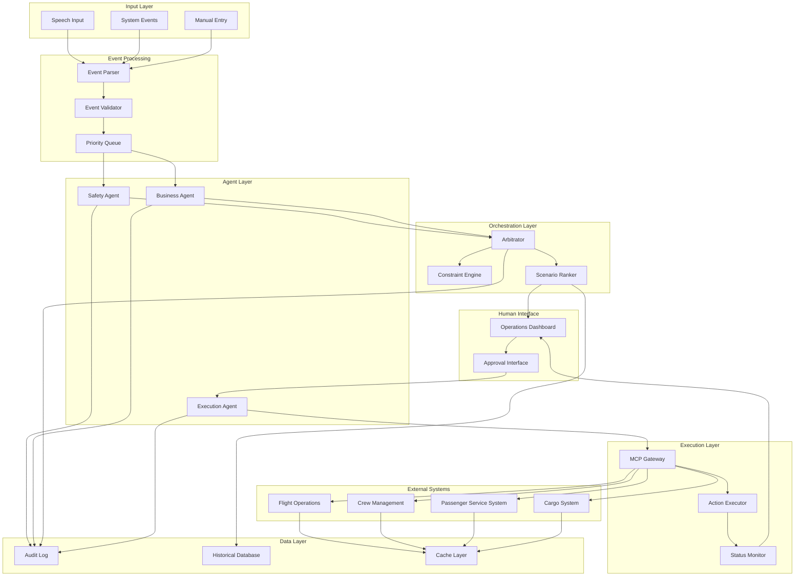

# Design Document: SkyMarshal

## Overview

SkyMarshal is a multi-agent AI system for airline disruption management that coordinates specialized agents through a central arbitration layer. The system architecture follows a hierarchical agent pattern where Safety Agents enforce non-negotiable constraints, Business Agents optimize outcomes through negotiation, and Execution Agents perform recovery actions via MCP protocol integration.

The design emphasizes:

- **Safety-first architecture**: Safety constraints are immutable and enforced at every decision point
- **Agent specialization**: Each agent type has a clearly defined domain and responsibility
- **MCP-based integration**: All external system interactions use Model Context Protocol
- **Audit transparency**: Complete decision traceability from event to execution
- **Human-in-the-loop**: Critical decisions require explicit human approval

## Architecture

### High-Level Architecture



### Agent Communication Pattern

The system uses a structured communication protocol between agents:

1. **Event Broadcast**: Disruption events are broadcast to all relevant agents
2. **Constraint Publication**: Safety Agent publishes binding constraints
3. **Proposal Generation**: Business Agent generates recovery scenarios
4. **Critique Exchange**: Agents exchange critiques and refinements
5. **Arbitration**: Arbitrator synthesizes and ranks scenarios
6. **Approval**: Human approves selected scenario
7. **Execution**: Execution Agent performs recovery actions

## Components and Interfaces

### Event Processing Components

#### Event Parser

Converts raw input (speech, system events, manual entry) into structured disruption events.

```typescript
interface DisruptionEvent {
  eventId: string;
  timestamp: Date;
  source: "speech" | "system" | "manual";
  eventType:
    | "aircraft_mechanical"
    | "crew_unavailable"
    | "weather"
    | "atc_delay"
    | "other";
  affectedResources: AffectedResources;
  severity: "low" | "medium" | "high" | "critical";
  rawData: any;
}

interface AffectedResources {
  flights: FlightReference[];
  aircraft: AircraftReference[];
  crew: CrewReference[];
  passengers: PassengerReference[];
  cargo: CargoReference[];
}

class EventParser {
  parseSpeechInput(audioData: Buffer): Promise<DisruptionEvent>;
  parseSystemEvent(systemData: any): Promise<DisruptionEvent>;
  parseManualEntry(manualData: any): Promise<DisruptionEvent>;
}
```

#### Event Validator

Validates event structure and completeness before processing.

```typescript
interface ValidationResult {
  isValid: boolean;
  errors: ValidationError[];
  warnings: ValidationWarning[];
}

class EventValidator {
  validate(event: DisruptionEvent): ValidationResult;
  validateResourceReferences(resources: AffectedResources): boolean;
  validateEventType(eventType: string): boolean;
}
```

#### Priority Queue

Manages multiple concurrent disruptions with priority ordering.

```typescript
interface QueuedEvent {
  event: DisruptionEvent;
  priority: number;
  queuedAt: Date;
  processingStatus: "queued" | "processing" | "completed" | "failed";
}

class EventQueue {
  enqueue(event: DisruptionEvent): void;
  dequeue(): QueuedEvent | null;
  calculatePriority(event: DisruptionEvent): number;
  getQueueStatus(): QueuedEvent[];
}
```

### Agent Components

#### Safety Agent

Enforces non-negotiable safety and regulatory constraints.

```typescript
interface SafetyConstraint {
  constraintId: string;
  constraintType:
    | "crew_duty"
    | "aircraft_maintenance"
    | "regulatory"
    | "operational";
  description: string;
  isViolated: boolean;
  violationDetails?: string;
  immutable: true;
}

interface CrewDutyConstraints {
  maxFlightDutyPeriod: number;
  minRestPeriod: number;
  qualifications: string[];
  currentDutyHours: number;
}

interface AircraftMaintenanceConstraints {
  melItems: MELItem[];
  aogStatus: boolean;
  nextMaintenanceDue: Date;
  releaseStatus: "released" | "pending" | "grounded";
}

interface RegulatoryConstraints {
  notams: NOTAM[];
  curfews: Curfew[];
  atcRestrictions: ATCRestriction[];
  bilateralAgreements: BilateralAgreement[];
}

class SafetyAgent {
  evaluateConstraints(scenario: RecoveryScenario): SafetyConstraint[];
  publishConstraints(eventId: string): SafetyConstraint[];
  validateCrewDuty(crewAssignment: CrewAssignment): SafetyConstraint[];
  validateAircraftStatus(aircraft: AircraftReference): SafetyConstraint[];
  validateRegulatoryCompliance(flight: FlightReference): SafetyConstraint[];
  logConstraintEvaluation(evaluation: ConstraintEvaluation): void;
}
```

#### Business Agent

Optimizes business outcomes through multi-dimensional impact assessment.

```typescript
interface BusinessImpact {
  passengerImpact: PassengerImpact;
  cargoImpact: CargoImpact;
  networkImpact: NetworkImpact;
  financialImpact: FinancialImpact;
  overallScore: number;
}

interface PassengerImpact {
  affectedCount: number;
  missedConnections: number;
  loyaltyTierDistribution: Map<string, number>;
  guestExperienceScore: number;
}

interface CargoImpact {
  affectedShipments: number;
  totalValue: number;
  perishableCount: number;
  coldChainViolations: number;
}

interface NetworkImpact {
  downstreamFlights: number;
  rotationDisruptions: number;
  propagationScore: number;
}

interface FinancialImpact {
  estimatedCost: number;
  revenueAtRisk: number;
  compensationLiability: number;
}

interface RecoveryScenario {
  scenarioId: string;
  description: string;
  actions: RecoveryAction[];
  businessImpact: BusinessImpact;
  safetyConstraints: SafetyConstraint[];
  rationale: string;
  estimatedDuration: number;
}

class BusinessAgent {
  assessImpact(event: DisruptionEvent): Promise<BusinessImpact>;
  generateScenarios(
    event: DisruptionEvent,
    constraints: SafetyConstraint[],
  ): Promise<RecoveryScenario[]>;
  critiqueScenario(scenario: RecoveryScenario): ScenarioCritique;
  refineScenario(
    scenario: RecoveryScenario,
    critique: ScenarioCritique,
  ): RecoveryScenario;
}
```

#### Execution Agent

Performs recovery actions via MCP protocol integration.

```typescript
interface RecoveryAction {
  actionId: string;
  actionType:
    | "flight_change"
    | "crew_recovery"
    | "passenger_rebook"
    | "cargo_recovery";
  targetSystem: string;
  mcpOperation: MCPOperation;
  status: "pending" | "executing" | "completed" | "failed";
  executedAt?: Date;
  result?: ActionResult;
}

interface MCPOperation {
  protocol: "mcp";
  endpoint: string;
  method: string;
  payload: any;
  timeout: number;
}

interface ActionResult {
  success: boolean;
  message: string;
  data?: any;
  error?: Error;
}

class ExecutionAgent {
  executeScenario(scenario: RecoveryScenario): Promise<ExecutionResult>;
  executeAction(action: RecoveryAction): Promise<ActionResult>;
  updateFlightSchedule(changes: FlightChange[]): Promise<ActionResult>;
  modifyCrewPairings(changes: CrewChange[]): Promise<ActionResult>;
  rebookPassengers(rebookings: PassengerRebooking[]): Promise<ActionResult>;
  updateCargoRouting(changes: CargoChange[]): Promise<ActionResult>;
  monitorExecution(scenarioId: string): ExecutionStatus;
  haltExecution(scenarioId: string, reason: string): void;
}
```

### Orchestration Components

#### Arbitrator

Central coordination component that enforces constraints and synthesizes scenarios.

```typescript
interface ArbitrationResult {
  rankedScenarios: RankedScenario[];
  constraintViolations: SafetyConstraint[];
  arbitrationRationale: string;
  timestamp: Date;
}

interface RankedScenario {
  scenario: RecoveryScenario;
  rank: number;
  score: number;
  rationale: string;
  historicalComparison?: HistoricalComparison;
}

class Arbitrator {
  arbitrateScenarios(
    scenarios: RecoveryScenario[],
    constraints: SafetyConstraint[],
  ): ArbitrationResult;

  enforceConstraints(
    scenario: RecoveryScenario,
    constraints: SafetyConstraint[],
  ): boolean;
  resolveConflicts(scenarios: RecoveryScenario[]): RecoveryScenario[];
  synthesizeRecommendation(scenarios: RecoveryScenario[]): RankedScenario[];
}
```

#### Constraint Engine

Validates all scenarios against safety constraints.

```typescript
interface ConstraintEvaluation {
  scenarioId: string;
  constraints: SafetyConstraint[];
  allSatisfied: boolean;
  violations: ConstraintViolation[];
  evaluatedAt: Date;
}

interface ConstraintViolation {
  constraintId: string;
  severity: "critical" | "major" | "minor";
  description: string;
  affectedResources: string[];
}

class ConstraintEngine {
  evaluateScenario(
    scenario: RecoveryScenario,
    constraints: SafetyConstraint[],
  ): ConstraintEvaluation;
  checkCrewConstraints(scenario: RecoveryScenario): ConstraintViolation[];
  checkAircraftConstraints(scenario: RecoveryScenario): ConstraintViolation[];
  checkRegulatoryConstraints(scenario: RecoveryScenario): ConstraintViolation[];
}
```

#### Scenario Ranker

Ranks scenarios using historical data and business rules.

```typescript
interface RankingCriteria {
  historicalPerformance: number;
  businessImpactScore: number;
  executionComplexity: number;
  riskAssessment: number;
}

interface HistoricalComparison {
  similarDisruptions: DisruptionEvent[];
  successRate: number;
  averageResolutionTime: number;
  lessonsLearned: string[];
}

class ScenarioRanker {
  rankScenarios(scenarios: RecoveryScenario[]): RankedScenario[];
  calculateScore(scenario: RecoveryScenario, criteria: RankingCriteria): number;
  findSimilarDisruptions(event: DisruptionEvent): HistoricalComparison;
  explainRanking(scenario: RankedScenario): string;
}
```

### Human Interface Components

#### Operations Dashboard

Real-time visualization of disruption status and system activity.

```typescript
interface DashboardState {
  activeDisruptions: DisruptionEvent[];
  pendingApprovals: RankedScenario[];
  executingScenarios: ExecutionStatus[];
  systemHealth: SystemHealth;
  recentActivity: ActivityLog[];
}

interface SystemHealth {
  agentStatus: Map<string, "healthy" | "degraded" | "offline">;
  mcpConnections: Map<string, "connected" | "disconnected">;
  queueDepth: number;
  averageResponseTime: number;
}

class OperationsDashboard {
  getState(): DashboardState;
  subscribeToUpdates(callback: (state: DashboardState) => void): void;
  displayDisruption(event: DisruptionEvent): void;
  highlightConstraints(constraints: SafetyConstraint[]): void;
  showScenarioComparison(scenarios: RankedScenario[]): void;
}
```

#### Approval Interface

Human approval workflow for recovery scenarios.

```typescript
interface ApprovalRequest {
  requestId: string;
  scenarios: RankedScenario[];
  recommendedScenario: RankedScenario;
  safetyImplications: string[];
  businessImpact: BusinessImpact;
  requiredBy: Date;
}

interface ApprovalDecision {
  requestId: string;
  approvedScenarioId: string | null;
  decision: "approved" | "rejected" | "request_alternatives";
  dutyManager: string;
  timestamp: Date;
  comments?: string;
  safetyAcknowledgment: boolean;
}

class ApprovalInterface {
  presentScenarios(request: ApprovalRequest): void;
  displaySafetyConstraints(constraints: SafetyConstraint[]): void;
  displayBusinessImpact(impact: BusinessImpact): void;
  displayExecutionPlan(actions: RecoveryAction[]): void;
  captureDecision(): Promise<ApprovalDecision>;
  requestAlternatives(reason: string): void;
}
```

### Data Layer Components

#### Audit Log

Immutable log of all system decisions and actions.

```typescript
interface AuditEntry {
  entryId: string;
  timestamp: Date;
  eventId: string;
  entryType:
    | "event"
    | "constraint"
    | "scenario"
    | "decision"
    | "action"
    | "result";
  actor: string;
  action: string;
  data: any;
  hash: string;
  previousHash: string;
}

class AuditLog {
  logEvent(event: DisruptionEvent): void;
  logConstraintEvaluation(evaluation: ConstraintEvaluation): void;
  logScenarioGeneration(scenarios: RecoveryScenario[]): void;
  logApprovalDecision(decision: ApprovalDecision): void;
  logActionExecution(action: RecoveryAction, result: ActionResult): void;
  queryLog(criteria: QueryCriteria): AuditEntry[];
  generateAuditReport(eventId: string): AuditReport;
  verifyIntegrity(): boolean;
}
```

#### Historical Database

Stores past disruptions and outcomes for learning.

```typescript
interface DisruptionRecord {
  eventId: string;
  event: DisruptionEvent;
  scenarios: RecoveryScenario[];
  selectedScenario: RecoveryScenario;
  executionResult: ExecutionResult;
  actualOutcome: DisruptionOutcome;
  performanceMetrics: PerformanceMetrics;
}

interface DisruptionOutcome {
  resolutionTime: number;
  passengerSatisfaction: number;
  actualCost: number;
  lessonsLearned: string[];
}

interface PerformanceMetrics {
  scenarioGenerationTime: number;
  approvalTime: number;
  executionTime: number;
  successRate: number;
}

class HistoricalDatabase {
  storeDisruption(record: DisruptionRecord): void;
  findSimilarDisruptions(
    event: DisruptionEvent,
    limit: number,
  ): DisruptionRecord[];
  getPerformanceTrends(timeRange: TimeRange): PerformanceMetrics[];
  updateOutcome(eventId: string, outcome: DisruptionOutcome): void;
  generateLearningReport(): LearningReport;
}
```

### MCP Integration Components

#### MCP Gateway

Manages all external system interactions via Model Context Protocol.

```typescript
interface MCPConnection {
  connectionId: string;
  targetSystem: string;
  endpoint: string;
  status: "connected" | "disconnected" | "error";
  lastHealthCheck: Date;
}

interface MCPRequest {
  requestId: string;
  operation: MCPOperation;
  retryPolicy: RetryPolicy;
  timeout: number;
}

interface MCPResponse {
  requestId: string;
  success: boolean;
  data?: any;
  error?: MCPError;
  duration: number;
}

class MCPGateway {
  connect(
    targetSystem: string,
    config: ConnectionConfig,
  ): Promise<MCPConnection>;
  disconnect(connectionId: string): void;
  executeOperation(request: MCPRequest): Promise<MCPResponse>;
  healthCheck(connectionId: string): Promise<boolean>;
  handleFailure(request: MCPRequest, error: MCPError): Promise<MCPResponse>;
}
```

## Data Models

### Core Domain Models

```typescript
// Flight Domain
interface FlightReference {
  flightNumber: string;
  departureDate: Date;
  origin: string;
  destination: string;
  scheduledDeparture: Date;
  scheduledArrival: Date;
  aircraftRegistration: string;
  status: FlightStatus;
}

type FlightStatus =
  | "scheduled"
  | "delayed"
  | "cancelled"
  | "diverted"
  | "completed";

interface FlightChange {
  flightNumber: string;
  changeType: "tail_swap" | "time_change" | "cancellation" | "diversion";
  newAircraft?: string;
  newDeparture?: Date;
  newArrival?: Date;
  reason: string;
}

// Aircraft Domain
interface AircraftReference {
  registration: string;
  aircraftType: string;
  currentLocation: string;
  maintenanceStatus: MaintenanceStatus;
  nextScheduledFlight?: FlightReference;
}

interface MaintenanceStatus {
  isAOG: boolean;
  melItems: MELItem[];
  nextCheckDue: Date;
  releaseStatus: "released" | "pending" | "grounded";
}

interface MELItem {
  itemNumber: string;
  description: string;
  category: "A" | "B" | "C" | "D";
  expiryDate: Date;
  restrictions: string[];
}

// Crew Domain
interface CrewReference {
  employeeId: string;
  name: string;
  position: "captain" | "first_officer" | "flight_attendant";
  qualifications: string[];
  currentPairing?: PairingReference;
  dutyStatus: DutyStatus;
}

interface DutyStatus {
  currentDutyHours: number;
  maxDutyHours: number;
  nextRestPeriodStart: Date;
  minRestHours: number;
  isAvailable: boolean;
}

interface CrewAssignment {
  flightNumber: string;
  crewMembers: CrewReference[];
  assignmentType: "regular" | "deadhead" | "reserve";
}

interface CrewChange {
  flightNumber: string;
  changeType: "reassignment" | "deadhead" | "reserve_activation";
  removedCrew: string[];
  addedCrew: string[];
  reason: string;
}

// Passenger Domain
interface PassengerReference {
  pnr: string;
  passengerName: string;
  loyaltyTier: "none" | "silver" | "gold" | "platinum";
  itinerary: FlightReference[];
  hasConnections: boolean;
  specialNeeds?: string[];
}

interface PassengerRebooking {
  pnr: string;
  originalFlight: string;
  newFlight: string;
  accommodations?: Accommodation[];
  compensation?: Compensation;
}

interface Accommodation {
  type: "hotel" | "meal" | "transportation";
  provider: string;
  cost: number;
}

interface Compensation {
  type: "voucher" | "refund" | "miles";
  amount: number;
  reason: string;
}

// Cargo Domain
interface CargoReference {
  awbNumber: string;
  origin: string;
  destination: string;
  weight: number;
  value: number;
  specialHandling: SpecialHandling[];
  routedFlights: FlightReference[];
}

interface SpecialHandling {
  code: string;
  description: string;
  requirements: string[];
  isPerishable: boolean;
  requiresColdChain: boolean;
}

interface CargoChange {
  awbNumber: string;
  changeType: "reroute" | "delay" | "offload";
  newRouting?: FlightReference[];
  reason: string;
}

// Regulatory Domain
interface NOTAM {
  notamId: string;
  airport: string;
  effectiveFrom: Date;
  effectiveTo: Date;
  description: string;
  impact: string;
}

interface Curfew {
  airport: string;
  startTime: string;
  endTime: string;
  exemptions: string[];
}

interface ATCRestriction {
  restrictionId: string;
  affectedRoutes: string[];
  restrictionType: string;
  effectiveFrom: Date;
  effectiveTo: Date;
}

interface BilateralAgreement {
  countries: string[];
  restrictions: string[];
  requiredPermits: string[];
}
```

### Execution Models

```typescript
interface ExecutionResult {
  scenarioId: string;
  status: "success" | "partial" | "failed";
  completedActions: RecoveryAction[];
  failedActions: RecoveryAction[];
  totalDuration: number;
  errors: ExecutionError[];
}

interface ExecutionError {
  actionId: string;
  errorType: string;
  message: string;
  timestamp: Date;
  recoverable: boolean;
}

interface ExecutionStatus {
  scenarioId: string;
  currentAction: RecoveryAction;
  progress: number;
  estimatedCompletion: Date;
  lastUpdate: Date;
}
```

### Configuration Models

```typescript
interface SystemConfiguration {
  agentConfig: AgentConfiguration;
  mcpConfig: MCPConfiguration;
  performanceConfig: PerformanceConfiguration;
  auditConfig: AuditConfiguration;
}

interface AgentConfiguration {
  safetyAgentEndpoint: string;
  businessAgentEndpoint: string;
  executionAgentEndpoint: string;
  maxConcurrentDisruptions: number;
  scenarioGenerationTimeout: number;
}

interface MCPConfiguration {
  connections: Map<string, ConnectionConfig>;
  retryPolicy: RetryPolicy;
  timeout: number;
}

interface ConnectionConfig {
  endpoint: string;
  authentication: AuthConfig;
  healthCheckInterval: number;
}

interface RetryPolicy {
  maxRetries: number;
  backoffMultiplier: number;
  initialDelay: number;
}

interface PerformanceConfiguration {
  eventProcessingTimeout: number;
  scenarioGenerationTimeout: number;
  executionTimeout: number;
  maxQueueSize: number;
}

interface AuditConfiguration {
  retentionPeriod: number;
  compressionEnabled: boolean;
  encryptionEnabled: boolean;
}
```
