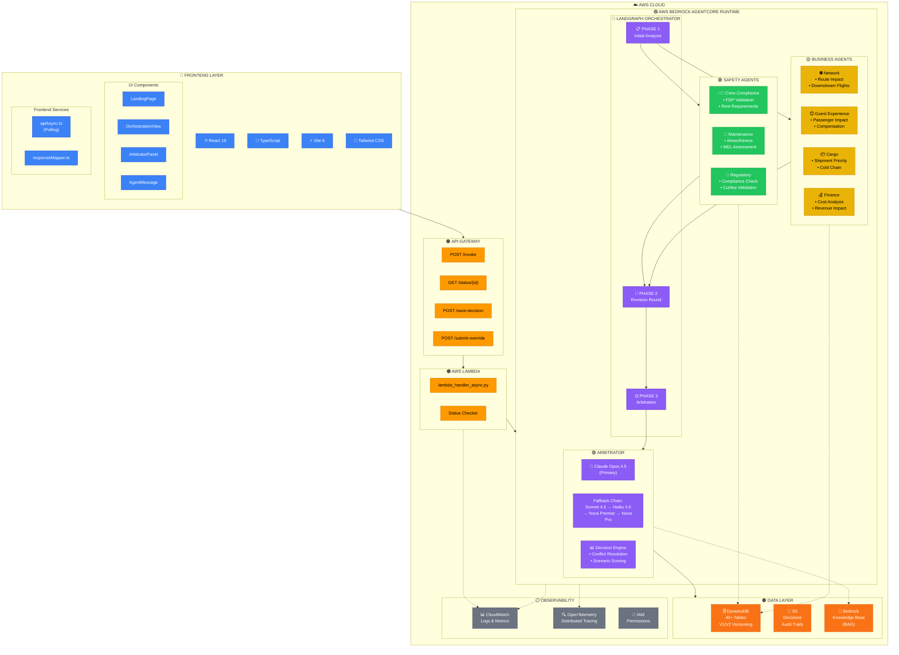
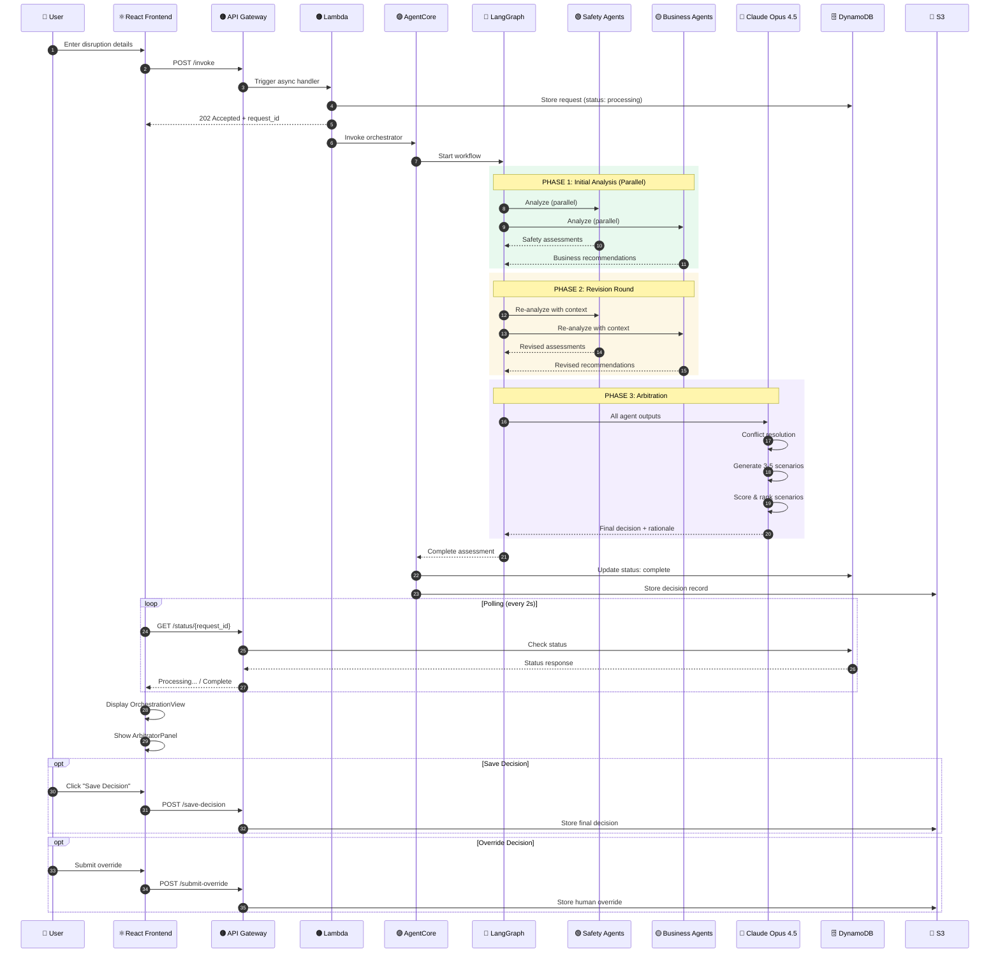
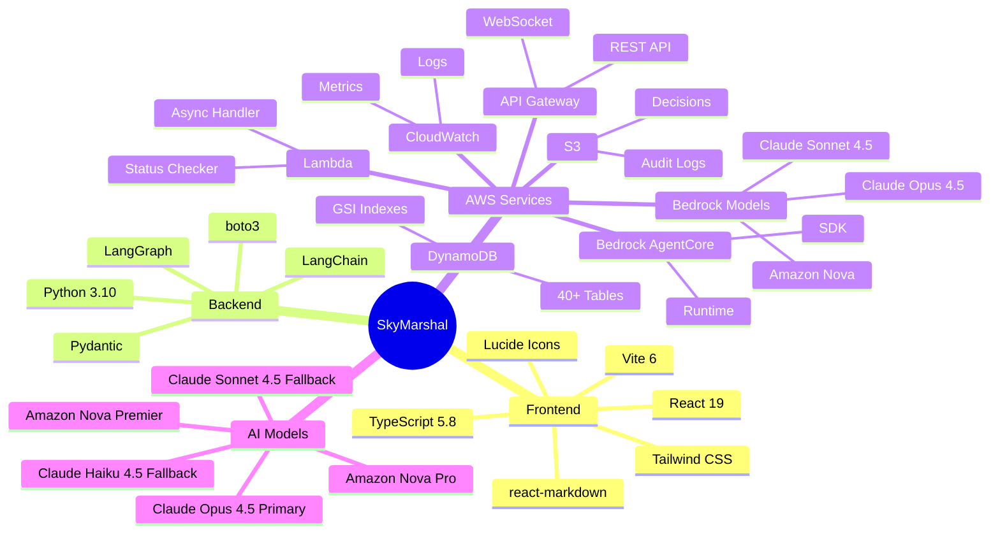
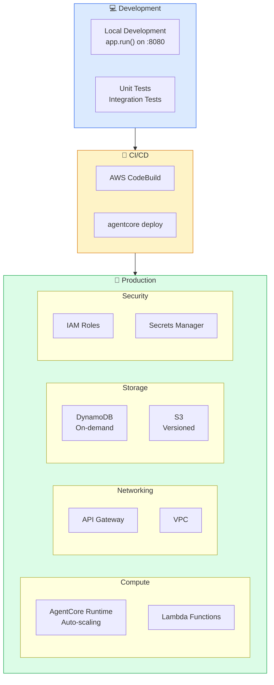

# SkyMarshal Architecture Diagram

## System Architecture Overview

---

## Data Flow Sequence

---

## Technology Stack

---

## Agent Architecture

```mermaid
flowchart LR
    subgraph Input["📥 INPUT"]
        Disruption["Flight Disruption\n• Flight: EY123\n• Issue: Hydraulic fault\n• Passengers: 615"]
    end

    subgraph Phase1["📋 PHASE 1"]
        direction TB
        P1Safety["🟢 Safety Analysis"]
        P1Business["🟡 Business Analysis"]
    end

    subgraph SafetyDetail["Safety Agents Detail"]
        direction TB
        S1["👨‍✈️ Crew Compliance\nFDP: 3.5hrs remaining\nStatus: APPROVED"]
        S2["🔧 Maintenance\nMEL Category B\nStatus: DEFERRABLE"]
        S3["📜 Regulatory\nCurfew Risk: 20:00\nStatus: CONDITIONAL"]
    end

    subgraph BusinessDetail["Business Agents Detail"]
        direction TB
        B1["🌐 Network\nDownstream: $450K impact\nPriority: HIGH"]
        B2["😊 Guest Experience\nCompensation: €125K\nRisk: MEDIUM"]
        B3["📦 Cargo\nCritical: 3 shipments\nOffload: NO"]
        B4["💰 Finance\nCancel: €1.2M\nDelay: €210K"]
    end

    subgraph Phase2["🔄 PHASE 2"]
        Revision["Context-Aware\nRevision"]
    end

    subgraph Phase3["⚖️ PHASE 3"]
        ArbitratorBox["🧠 ARBITRATOR\nClaude Opus 4.5"]
    end

    subgraph Output["📤 OUTPUT"]
        Decision["✅ Final Decision\nScenario: RS-001\nScore: 75.9/100\nConfidence: 78%"]
        Scenarios["📊 Recovery Scenarios\n1. Expedited Delay\n2. Aircraft Swap\n3. Passenger Rebooking\n4. Cancel & Reroute"]
    end

    Disruption --> Phase1
    Phase1 --> SafetyDetail
    Phase1 --> BusinessDetail
    SafetyDetail --> Phase2
    BusinessDetail --> Phase2
    Phase2 --> Phase3
    Phase3 --> Output

    style Input fill:#e0e7ff,stroke:#4f46e5
    style Phase1 fill:#dcfce7,stroke:#16a34a
    style Phase2 fill:#fef9c3,stroke:#ca8a04
    style Phase3 fill:#f3e8ff,stroke:#9333ea
    style Output fill:#dbeafe,stroke:#2563eb
```

---

## Infrastructure Deployment

---

## Legend

| Icon | Component | Description |
|------|-----------|-------------|
| ⚛️ | React | Frontend framework |
| 📘 | TypeScript | Type-safe JavaScript |
| ⚡ | Vite | Build tool |
| 🔗 | LangGraph | Orchestration framework |
| 🧠 | Claude Opus 4.5 | Primary AI model |
| 🟢 | Safety Agents | Crew, Maintenance, Regulatory |
| 🟡 | Business Agents | Network, Guest, Cargo, Finance |
| 🟠 | AWS Services | Lambda, API Gateway, DynamoDB, S3 |
| 🟣 | AI/ML | Bedrock, AgentCore |
| ⚪ | Observability | CloudWatch, OpenTelemetry |

---

## Key Metrics

| Metric | Value |
|--------|-------|
| **Total Agents** | 7 domain + 1 arbitrator |
| **DynamoDB Tables** | 40+ (V1 & V2) |
| **Processing Phases** | 3 (Initial → Revision → Arbitration) |
| **Model Fallback Depth** | 5 models |
| **Typical Response Time** | 45-60 seconds |
| **Context Window** | 200K tokens (Claude Opus 4.5) |
